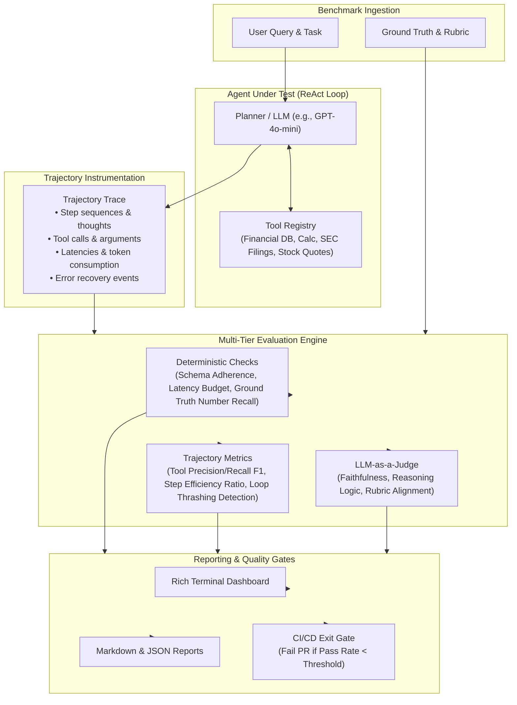

# Agent Evaluation Framework (`agent-eval-harness`)

[](https://github.com)
[](https://python.org)
[](LICENSE)
[](reports/benchmark_report.md)
[](https://docs.pydantic.dev/)

> **A production-ready evaluation and regression-testing framework for multi-step, tool-calling AI agents with trajectory analysis, LLM-as-a-judge scoring, and CI/CD quality gating.**

---

## 📌 Overview

While evaluating standard LLMs relies on simple input-output matching, **autonomous AI agents** execute non-deterministic, multi-step reasoning loops, select external tools, and handle real-world API failures. 

Evaluating only the final text response misses critical failure modes:
* **Tool Thrashing:** Calling the same tool in an infinite loop.
* **Inefficient Trajectories:** Taking 7 steps when 2 were sufficient.
* **Schema Violations:** Passing invalid or hallucinated arguments to tools.
* **Ungrounded Claims:** Answering correctly by chance despite empty or failing tool responses.

The **Agent Evaluation Framework** bridges this gap by instrumenting and grading **complete execution trajectories**—evaluating *how* the agent reached its conclusion, not just *what* it said.

---

## 🏗️ System Architecture



---

## 📊 Core Evaluated Metrics

| Category | Metric | Description & Formulation | Target |
| :--- | :--- | :--- | :---: |
| **Trajectory** | **Tool Selection $F_1$** | Harmonic mean of tool selection Precision and Recall against expected tools. | $\ge 0.85$ |
| **Trajectory** | **Step Efficiency Ratio** | $\min\left(1.0, \frac{\text{Optimal Steps}}{\text{Actual Steps}}\right)$ — penalizes unnecessary intermediate hops. | $\ge 0.70$ |
| **Trajectory** | **Loop Thrashing** | Detects duplicate tool calls executed with identical arguments. | $1.00$ *(no loops)* |
| **Deterministic** | **Schema Adherence** | Percentage of tool calls that validated and ran without unhandled runtime exceptions. | $1.00$ |
| **Deterministic** | **Numeric Recall** | Percentage of ground-truth numerical constants verified in the final output. | $\ge 0.80$ |
| **Deterministic** | **Latency Budget** | Evaluates wall-clock completion against maximum threshold budgets. | $\le 15000\text{ ms}$ |
| **Qualitative** | **LLM-as-a-Judge** | Structured rubric scoring evaluating reasoning soundness and hallucination resistance. | $\ge 0.80$ |

---

## ⚡ Quick Start

### 1. Installation

```bash
# Clone the repository
git clone https://github.com/your-username/agent-evaluation-framework.git
cd agent-evaluation-framework

# Install in editable mode with dependencies
pip install -e ".[dev]"
```

### 2. Run the Benchmark (Zero-Cost / Offline Mode)

The framework includes a simulated agent engine so you can run and inspect the full benchmark pipeline immediately without needing API keys or incurring costs:

```bash
# Run benchmark via Makefile
make bench

# Or directly via CLI
python benchmark/run_benchmark.py --mode mock --min-pass-rate 80.0
```

### 3. Run with Live OpenAI Models

To benchmark live LLMs (e.g. `gpt-4o-mini`, `gpt-4o`, or any OpenAI-compatible endpoint):

```bash
# Set your API key
cp .env.example .env
export OPENAI_API_KEY="your-api-key-here"

# Execute live benchmark
python benchmark/run_benchmark.py --mode llm --model gpt-4o-mini
```

---

## 🖥️ Terminal Dashboard & Reporting

When running the benchmark, the built-in `BenchmarkReporter` produces a real-time `Rich` console dashboard and automatically generates a GitHub-ready markdown report:

```text
╭──────────────────────────────────────────────────────────────────────────────╮
│ Agent Evaluation Harness | Model: gpt-4o-mini | Pass Rate: 100.0%             │
╰──────────────────────────────────────────────────────────────────────────────╯
      Overall Benchmark Performance       
┏━━━━━━━━━━━━━━━━━━━━━━━━━━━━┳━━━━━━━━━━━┓
┃ Metric                     ┃     Value ┃
┡━━━━━━━━━━━━━━━━━━━━━━━━━━━━╇━━━━━━━━━━━┩
│ Total Test Cases           │         8 │
│ Passed Cases               │         8 │
│ Failed Cases               │         0 │
│ Pass Rate                  │    100.0% │
│ Mean Score                 │     0.957 │
│ Avg Tool Precision         │      1.00 │
│ Avg Tool Recall            │      1.00 │
│ Avg Step Efficiency        │      1.00 │
│ Avg Latency                │    0.1 ms │
│ Total Estimated Cost       │ $0.000990 │
└────────────────────────────┴───────────┘
```

A complete report is saved to `reports/benchmark_report.md` alongside machine-readable JSON metrics in `reports/benchmark_results.json`.

---

## 📁 Repository Structure

```text
agent-evaluation-framework/
├── .github/
│   └── workflows/
│       └── eval-ci.yml           # Automated CI regression gate
├── benchmark/
│   ├── datasets/                 # Golden evaluation datasets (JSONL)
│   │   └── financial_agent_benchmark.jsonl
│   └── run_benchmark.py          # Unified CLI benchmark runner
├── reports/                      # Auto-generated markdown & JSON reports
│   ├── benchmark_report.md
│   └── benchmark_results.json
├── src/
│   └── agent_eval/
│       ├── agent/
│       │   ├── core.py           # Multi-step ReAct agent with trajectory logging
│       │   └── tools.py          # Real/mock tools (DB query, ratio calc, SEC search, quote)
│       ├── evaluators/
│       │   ├── base.py           # Abstract BaseEvaluator interface
│       │   ├── deterministic.py  # Schema adherence, numeric match, latency budget
│       │   ├── judge.py          # LLM-as-a-judge with rubrics & fallback heuristics
│       │   └── trajectory.py     # Tool precision/recall, step efficiency, loop detection
│       ├── reporting/
│       │   └── reporter.py       # Rich CLI tables & Markdown exporter
│       └── models.py             # Pydantic v2 data models for trajectories & benchmarks
├── tests/
│   ├── test_agent.py             # Unit tests for agent execution and tools
│   ├── test_benchmark.py         # End-to-end benchmark pipeline tests
│   └── test_evaluators.py        # Unit tests for all individual metrics
├── .env.example
├── .gitignore
├── LICENSE
├── Makefile
├── pyproject.toml
└── requirements.txt
```

---

## 🛠️ Automated CI/CD Regression Gate

In modern LLM applications, minor prompt adjustments or model version bumps can unexpectedly degrade agent decision-making. 

This framework acts as a **pull request quality gate** in GitHub Actions (`.github/workflows/eval-ci.yml`). If a code change causes:
1. Overall pass rate to drop below **80%**
2. Tool selection F1 score to drop below **0.80**
3. Infinite loop thrashing to be detected

The CI pipeline automatically exits with a non-zero code, blocking regressions from reaching production.

---

## 🧪 Running Tests

```bash
# Run complete pytest test suite
make test

# Or directly:
pytest -v tests/
```

---

## 📄 License

This project is open-source under the [MIT License](LICENSE).
